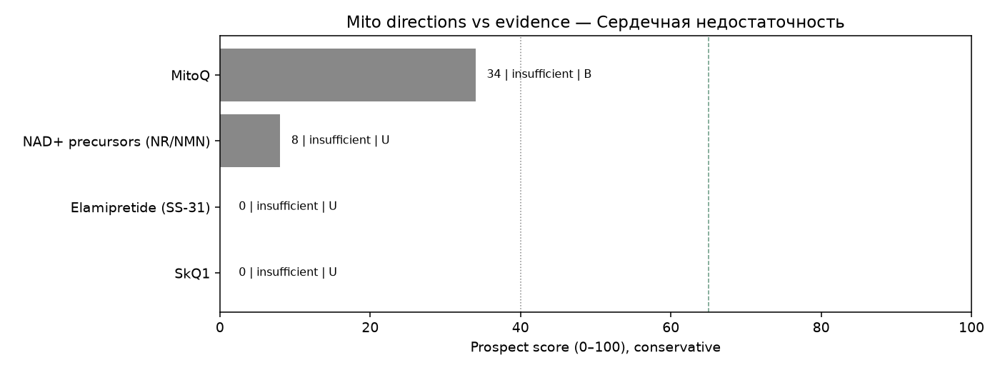

# Мини-обзор: митохондриальная терапия при Сердечная недостаточность

_Сгенерировано Harness · 2026-09-30 09:26 UTC_

> **Не медицинская рекомендация.** Это исследовательский экспресс-обзор. Не начинайте, не отменяйте и не меняйте лечение на основании этого текста — решения принимает только лечащий врач.

## Запрос
MitoQ OR elamipretide OR NAD in Heart failure

## Стандарт лечения (справочно из каталога, не назначение)
иАПФ/АРНИ, бета-блокаторы, антагонисты МКР, SGLT2i, диуретики, устройства по показаниям

## Источники (официальные)
Всего извлечено записей: **12** (только PubMed PMID и ClinicalTrials.gov NCT этого прогона).

- [39070278](https://pubmed.ncbi.nlm.nih.gov/39070278/), DOI:10.1016/j.jacbts.2024.02.013 — Coordinate Targeting of Mitochondrial Energetics, Antioxidant Defenses, and Inflammation: Is NAD+ Boosting an HFpEF Elixir? (type=other, evidence=U, effect=null, year=2024, journal=unknown)
- [36644286](https://pubmed.ncbi.nlm.nih.gov/36644286/), DOI:10.1016/j.jacbts.2022.07.008 — Tackling Inflammation at its Source in Heart Failure: Are Mitochondria the Key? (type=other, evidence=U, effect=null, year=2022, journal=unknown)
- [39995248](https://pubmed.ncbi.nlm.nih.gov/39995248/), DOI:10.1161/CIRCULATIONAHA.122.061732 — Autophagy is required for the therapeutic effects of the NAD+ precursor nicotinamide in obesity-related heart failure with preserved ejection fraction. (type=unknown, evidence=U, effect=null, year=2025, journal=trusted)
- [41212826](https://pubmed.ncbi.nlm.nih.gov/41212826/), DOI:10.1093/ehjci/jeaf310 — A double-blind, randomized placebo-controlled trial examining the effect of MitoQ on myocardial energetics in patients with dilated cardiomyopathy. (type=rct, evidence=B, effect=null, year=2026, journal=trusted)
- [40388563](https://pubmed.ncbi.nlm.nih.gov/40388563/), DOI:10.1002/ejhf.2635 — SGLT2 inhibitor with and without ALDosterone AntagonIst for heart failure with preserved ejection fraction: Design paper. (type=rct, evidence=B, effect=null, year=2025, journal=unknown)
- [41314931](https://pubmed.ncbi.nlm.nih.gov/41314931/), DOI:10.1016/j.ejim.2025.106615 — Robustness of randomized controlled trial evidence for SGLT2 inhibitors in heart failure with preserved and mildly reduced ejection fraction. (type=meta_analysis, evidence=A, effect=null, year=2026, journal=unknown)
- [41588709](https://pubmed.ncbi.nlm.nih.gov/41588709/), DOI:10.1111/dom.70503 — Comparative effectiveness of pharmacotherapy for heart failure with preserved ejection fraction: A systematic review and network meta-analysis. (type=meta_analysis, evidence=A, effect=null, year=2026, journal=unknown)
- [40306837](https://pubmed.ncbi.nlm.nih.gov/40306837/), DOI:10.1016/j.jacc.2025.03.429 — Finerenone Reduces New-Onset Atrial Fibrillation Across the Spectrum of Cardio-Kidney-Metabolic Syndrome: The FINE-HEART Pooled Analysis. (type=rct, evidence=B, effect=null, year=2025, journal=unknown)
- [39893467](https://pubmed.ncbi.nlm.nih.gov/39893467/), DOI:10.1186/s12933-017-0658-8 — Redefining outcomes of ventricular arrhythmia for SGLT2 inhibitor medication in heart failure patients: a meta-analysis of randomized controlled trials. (type=meta_analysis, evidence=A, effect=null, year=2025, journal=unknown)
- [33724883](https://pubmed.ncbi.nlm.nih.gov/33724883/), DOI:10.1161/CIRCHEARTFAILURE.120.007767 — Novel Trial Design: CHIEF-HF. (type=rct, evidence=B, effect=null, year=2021, journal=trusted)
- [NCT05191979](https://clinicaltrials.gov/study/NCT05191979) — Importance of Blood Volume and Its Interaction With Cardiovascular Adaptations (type=other, evidence=U, effect=null, year=2022, nct_status=UNKNOWN/other)
- [NCT05750979](https://clinicaltrials.gov/study/NCT05750979) — Quantifying Disease Progression in Leukoencephalopathy With Brainstem and Spinal Cord Involvement and Lactate Elevation (LBSL) (type=other, evidence=U, effect=null, year=2021, nct_status=UNKNOWN/other)

## Сигналы качества источников
- Журналы: trusted=3, suspect=0, unknown=7
- Упоминания COI в abstract/notes: 0
- NCT active=0, terminal/withdrawn/suspended=0
- Impact Factor через внешний платный API не запрашивается: используется curated whitelist/suspect list (см. `tools/quality.py` + skill `quality_signals`).

## Рейтинг направлений (консервативный)
1. **MitoQ** — score=34, label=`insufficient`, best=B, n=1, comparative_vs_SoC=not_supported. n=1; best=B; label=insufficient; human_benefit=False; preclinical_only=False; registry_only=False; superior_to_soc_supported=False; coi=0; journal_suspect=0; nct_terminal=0. IDs: 41212826
2. **NAD+ precursors (NR/NMN)** — score=8, label=`insufficient`, best=U, n=1, comparative_vs_SoC=not_supported. n=1; best=U; label=insufficient; human_benefit=False; preclinical_only=False; registry_only=False; superior_to_soc_supported=False; coi=0; journal_suspect=0; nct_terminal=0. IDs: 39995248
3. **Elamipretide (SS-31)** — score=0, label=`insufficient`, best=U, n=0, comparative_vs_SoC=not_supported. n=0; insufficient_data — нет PMID/NCT по направлению в этом прогоне. IDs: —
4. **SkQ1** — score=0, label=`insufficient`, best=U, n=0, comparative_vs_SoC=not_supported. n=0; insufficient_data — нет PMID/NCT по направлению в этом прогоне. IDs: —

## Относительно более поддержанные направления
- Недостаточно данных, чтобы выделить перспективные направления в этом окне поиска.

## Аутсайдеры / недостаточно данных
- **NAD+ precursors (NR/NMN)** (score=8, `insufficient`): n=1; best=U; label=insufficient; human_benefit=False; preclinical_only=False; registry_only=False; superior_to_soc_supported=False; coi=0; journal_suspect=0; nct_terminal=0.
- **Elamipretide (SS-31)** (score=0, `insufficient`): n=0; insufficient_data — нет PMID/NCT по направлению в этом прогоне.
- **SkQ1** (score=0, `insufficient`): n=0; insufficient_data — нет PMID/NCT по направлению в этом прогоне.

## Визуализация

## Сравнение с SoC
Превосходство митотерапии над стандартом **не заявляется**, если нет человеческих сравнительных данных (РКИ/метаанализ с компаратором) в извлечённых записях. Доклиника и записи ClinicalTrials.gov без результатов не равны клинической эффективности.

## Верификация (Reviewer)
- ok=True
- Критических замечаний нет.
- verified IDs in pipeline: 10.1002/ejhf.2635, 10.1016/j.ejim.2025.106615, 10.1016/j.jacbts.2022.07.008, 10.1016/j.jacbts.2024.02.013, 10.1016/j.jacc.2025.03.429, 10.1093/ehjci/jeaf310, 10.1111/dom.70503, 10.1161/CIRCHEARTFAILURE.120.007767, 10.1161/CIRCULATIONAHA.122.061732, 10.1186/s12933-017-0658-8, 33724883, 36644286, 39070278, 39893467, 39995248, 40306837, 40388563, 41212826, 41314931, 41588709, NCT05191979, NCT05750979

## Skills
evidence_levels, prospect_criteria, safety_guardrails, mito_extraction_rules, citation_checklist, quality_signals

## Ограничения
- Экспресс-обзор, не систематический обзор/метаанализ
- Окно поиска ~5 лет
- Возможны пропуски из‑за формулировок запросов
- Не является клинической рекомендацией; не меняйте терапию самостоятельно
- Эффект без явной опоры в abstract очищается (анти-галлюцинация)
- ClinicalTrials.gov без результатов не считается доказанной эффективностью
- Ярлык promising не выдаётся при отсутствии человеческих данных A/B/C
- Suspect-журналы и terminal NCT понижают score и не тянут promising
- Impact Factor числом не подтягивается (нет платного API) — whitelist/suspect эвристика
- COI извлекается только если явно упомянут в abstract/notes
