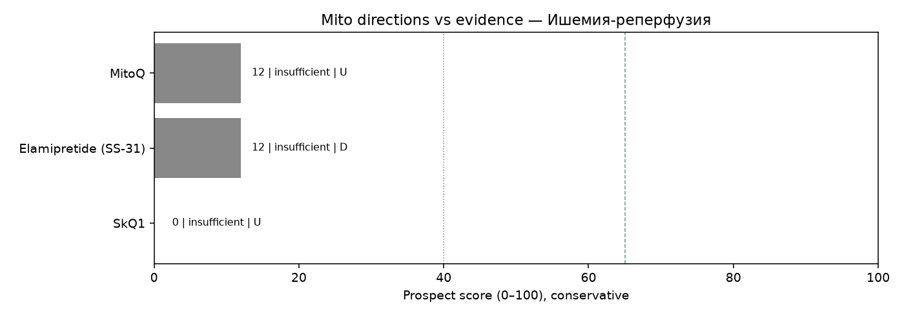

# Мини-обзор: митохондриальная терапия при Ишемия-реперфузия

_Сгенерировано Harness · 2026-09-30 09:28 UTC_

> **Не медицинская рекомендация.** Это исследовательский экспресс-обзор. Не начинайте, не отменяйте и не меняйте лечение на основании этого текста — решения принимает только лечащий врач.

## Запрос
MitoQ OR elamipretide OR NAD in Ischemia-reperfusion injury

## Стандарт лечения (справочно из каталога, не назначение)
Ранняя реперфузия (тромболизис/ЧКВ), стандартная кардио/органопротекция по протоколу

## Источники (официальные)
Всего извлечено записей: **12** (только PubMed PMID и ClinicalTrials.gov NCT этого прогона).

- [42358073](https://pubmed.ncbi.nlm.nih.gov/42358073/), DOI:10.1021/acs.nanolett.6c01908 — Topology-Controlled PEGylation Enhances Renal Accumulation of Therapeutic Peptide for Treating Ischemia-Reperfusion Injury. (type=preclinical, evidence=D, effect=null, year=2026, journal=unknown)
- [40794335](https://pubmed.ncbi.nlm.nih.gov/40794335/), DOI:10.1186/s12967-022-03542-0 — Asprosin protects against ischemia/reperfusion-induced kidney injury in mice. (type=preclinical, evidence=D, effect=null, year=2025, journal=unknown)
- [39848110](https://pubmed.ncbi.nlm.nih.gov/39848110/), DOI:10.1016/j.biopha.2025.117832 — SS-31@Fer-1 Alleviates ferroptosis in hypoxia/reoxygenation cardiomyocytes via mitochondrial targeting. (type=preclinical, evidence=D, effect=null, year=2025, journal=unknown)
- [39744161](https://pubmed.ncbi.nlm.nih.gov/39744161/), DOI:10.7150/ijms.102763 — Cardiomyopeptide-Regulated PPARγ Expression Plays a Critical Role in Maintaining Mitochondrial Integrity and Preventing Cardiac Ischemia/Reperfusion Injury. (type=preclinical, evidence=D, effect=null, year=2025, journal=unknown)
- [34399982](https://pubmed.ncbi.nlm.nih.gov/34399982/), DOI:10.1016/j.bja.2021.06.046 — Effects of inorganic nitrate on ischaemia-reperfusion injury after coronary artery bypass surgery: a randomised controlled trial. (type=rct, evidence=B, effect=null, year=2021, journal=unknown)
- [42574519](https://pubmed.ncbi.nlm.nih.gov/42574519/), DOI:10.1161/CIRCULATIONAHA.126.080096 — The Postcardiac Arrest Inflammatory Response: Mechanisms and Therapeutic Targets. (type=review, evidence=U, effect=null, year=2026, journal=trusted)
- [35358395](https://pubmed.ncbi.nlm.nih.gov/35358395/), DOI:10.1139/apnm-2021-0693 — A single dose of dietary nitrate supplementation protects against endothelial ischemia-reperfusion injury in early postmenopausal women. (type=rct, evidence=B, effect=null, year=2022, journal=unknown)
- [34868060](https://pubmed.ncbi.nlm.nih.gov/34868060/), DOI:10.1177/2396987316630249 — Understanding the Connection Between Common Stroke Comorbidities, Their Associated Inflammation, and the Course of the Cerebral Ischemia/Reperfusion Cascade. (type=review, evidence=U, effect=null, year=2021, journal=unknown)
- [36552727](https://pubmed.ncbi.nlm.nih.gov/36552727/), DOI:10.1016/S0021-9258(17)36891-6 — Protective Biomolecular Mechanisms of Glutathione Sodium Salt in Ischemia-Reperfusion Injury in Patients with Acute Coronary Syndrome-ST-Elevation Myocardial Infarction. (type=review, evidence=U, effect=null, year=2022, journal=unknown)
- [38308185](https://pubmed.ncbi.nlm.nih.gov/38308185/), DOI:10.1080/08941939.2018.1551948 — Progress in the study of mechanisms and pathways related to the survival of random skin flaps. (type=review, evidence=U, effect=null, year=2024, journal=unknown)
- [NCT07229261](https://clinicaltrials.gov/study/NCT07229261) — MitoQ (Mitoquinol Mesylate) to Ameliorate Vascular Function in Preeclampsia: a Novel Approach (type=other, evidence=U, effect=null, year=2026, nct_status=RECRUITING/active)
- [NCT05381454](https://clinicaltrials.gov/study/NCT05381454) — An Open Label Study in Adults to Test the Efficacy of Mitoquinone/Mitoquinol Mesylate as Prophylaxis for Development of Severe Viral Illness (type=other, evidence=U, effect=null, year=2022, nct_status=COMPLETED/completed)

## Сигналы качества источников
- Журналы: trusted=1, suspect=0, unknown=9
- Упоминания COI в abstract/notes: 0
- NCT active=1, terminal/withdrawn/suspended=0
- Impact Factor через внешний платный API не запрашивается: используется curated whitelist/suspect list (см. `tools/quality.py` + skill `quality_signals`).

## Рейтинг направлений (консервативный)
1. **MitoQ** — score=12, label=`insufficient`, best=U, n=2, comparative_vs_SoC=not_supported. n=2; best=U; label=insufficient; human_benefit=False; preclinical_only=False; registry_only=True; superior_to_soc_supported=False; coi=0; journal_suspect=0; nct_terminal=0. IDs: NCT07229261, NCT05381454
2. **Elamipretide (SS-31)** — score=12, label=`insufficient`, best=D, n=1, comparative_vs_SoC=not_supported. n=1; best=D; label=insufficient; human_benefit=False; preclinical_only=True; registry_only=False; superior_to_soc_supported=False; coi=0; journal_suspect=0; nct_terminal=0. IDs: 39848110
3. **SkQ1** — score=0, label=`insufficient`, best=U, n=0, comparative_vs_SoC=not_supported. n=0; insufficient_data — нет PMID/NCT по направлению в этом прогоне. IDs: —

## Относительно более поддержанные направления
- Недостаточно данных, чтобы выделить перспективные направления в этом окне поиска.

## Аутсайдеры / недостаточно данных
- **MitoQ** (score=12, `insufficient`): n=2; best=U; label=insufficient; human_benefit=False; preclinical_only=False; registry_only=True; superior_to_soc_supported=False; coi=0; journal_suspect=0; nct_terminal=0.
- **Elamipretide (SS-31)** (score=12, `insufficient`): n=1; best=D; label=insufficient; human_benefit=False; preclinical_only=True; registry_only=False; superior_to_soc_supported=False; coi=0; journal_suspect=0; nct_terminal=0.
- **SkQ1** (score=0, `insufficient`): n=0; insufficient_data — нет PMID/NCT по направлению в этом прогоне.

## Визуализация

## Сравнение с SoC
Превосходство митотерапии над стандартом **не заявляется**, если нет человеческих сравнительных данных (РКИ/метаанализ с компаратором) в извлечённых записях. Доклиника и записи ClinicalTrials.gov без результатов не равны клинической эффективности.

## Верификация (Reviewer)
- ok=True
- Критических замечаний нет.
- verified IDs in pipeline: 10.1016/S0021-9258(17)36891-6, 10.1016/j.biopha.2025.117832, 10.1016/j.bja.2021.06.046, 10.1021/acs.nanolett.6c01908, 10.1080/08941939.2018.1551948, 10.1139/apnm-2021-0693, 10.1161/CIRCULATIONAHA.126.080096, 10.1177/2396987316630249, 10.1186/s12967-022-03542-0, 10.7150/ijms.102763, 34399982, 34868060, 35358395, 36552727, 38308185, 39744161, 39848110, 40794335, 42358073, 42574519, NCT05381454, NCT07229261

## Skills
evidence_levels, prospect_criteria, safety_guardrails, mito_extraction_rules, citation_checklist, quality_signals

## Ограничения
- Экспресс-обзор, не систематический обзор/метаанализ
- Окно поиска ~5 лет
- Возможны пропуски из‑за формулировок запросов
- Не является клинической рекомендацией; не меняйте терапию самостоятельно
- Эффект без явной опоры в abstract очищается (анти-галлюцинация)
- ClinicalTrials.gov без результатов не считается доказанной эффективностью
- Ярлык promising не выдаётся при отсутствии человеческих данных A/B/C
- Suspect-журналы и terminal NCT понижают score и не тянут promising
- Impact Factor числом не подтягивается (нет платного API) — whitelist/suspect эвристика
- COI извлекается только если явно упомянут в abstract/notes
