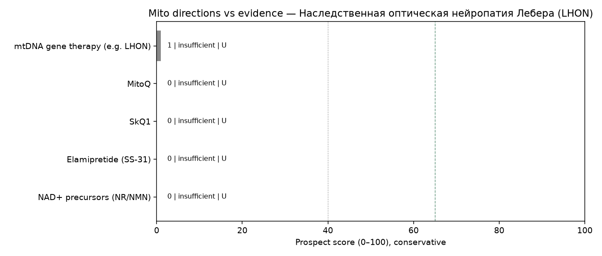

# Мини-обзор: митохондриальная терапия — Наследственная оптическая нейропатия Лебера (LHON)

_Сгенерировано Harness · 2026-09-30 12:06 UTC_

> **Не медицинская рекомендация.** Это исследовательский экспресс-обзор. Не начинайте, не отменяйте и не меняйте лечение на основании этого текста — решения принимает только лечащий врач.

## Запрос

Сравнение митохондриально-таргетной терапии и стандарта лечения при LHON за последние 5 лет: антиоксиданты, генная терапия мтДНК, перспективы и аутсайдеры

## Стандарт лечения (справочно из каталога, не назначение)

Поддерживающая терапия, отказ от курения/алкоголя; идебенон (где доступен); генная терапия (lenadogene nolparvovec / LUMEVOQ) в исследованиях

## Источники (официальные)

Всего извлечено записей: **12** (только PubMed PMID и ClinicalTrials.gov NCT этого прогона).

- [39766826](https://pubmed.ncbi.nlm.nih.gov/39766826/), [DOI](https://doi.org/10.1016/j.mito.2018.07.007) — Insights on the Genetic and Phenotypic Complexities of Optic Neuropathies. (type=`review`, evidence=`U`, effect=`null`, year=2024, journal=unknown)
- [36009477](https://pubmed.ncbi.nlm.nih.gov/36009477/), [DOI](https://doi.org/10.3389/fneur.2021.662838) — Leber Hereditary Optic Neuropathy: Molecular Pathophysiology and Updates on Gene Therapy. (type=`review`, evidence=`U`, effect=`null`, year=2022, journal=unknown)
- [38560422](https://pubmed.ncbi.nlm.nih.gov/38560422/), [DOI](https://doi.org/10.1016/j.omtn.2024.102170) — Secondary follicles enable efficient germline mtDNA base editing at hard-to-edit site. (type=`preclinical`, evidence=`D`, effect=`null`, year=2024, journal=unknown)
- [34630313](https://pubmed.ncbi.nlm.nih.gov/34630313/), [DOI](https://doi.org/10.1093/hmg/ddx273) — Editorial: Hereditary Optic Neuropathies: A New Perspective. (type=`other`, evidence=`U`, effect=`null`, year=2021, journal=trusted)
- [40670631](https://pubmed.ncbi.nlm.nih.gov/40670631/), [DOI](https://doi.org/10.1126/scitranslmed.aaz7423) — Infographic: landmark trials in neuro-ophthalmology - results of the REVERSE trial for unilateral gene therapy rAAV2/2-ND4 in leber hereditary optic neuropathy. (type=`other`, evidence=`U`, effect=`null`, year=2025, journal=unknown)
- [35791239](https://pubmed.ncbi.nlm.nih.gov/35791239/), [DOI](https://doi.org/10.4103/ijo.IJO_1758_21) — Ethambutol-induced conversion in Leber's hereditary optic neuropathy: 6 years follow-up. (type=`cohort`, evidence=`C`, effect=`null`, year=2022, journal=trusted)
- [34314394](https://pubmed.ncbi.nlm.nih.gov/34314394/), [DOI](https://doi.org/10.1097/WNO.0000000000001317) — Assessing the Treatment Effect of Idebenone in Leber Hereditary Optic Neuropathy Requires Appropriate Study Designs. (type=`other`, evidence=`U`, effect=`null`, year=2023, journal=trusted)
- [33709232](https://pubmed.ncbi.nlm.nih.gov/33709232/), [DOI](https://doi.org/10.1007/s10384-021-00827-7) — Characteristics of Japanese patients with Leber's hereditary optic neuropathy and idebenone trial: a prospective, interventional, non-comparative study. (type=`other`, evidence=`U`, effect=`null`, year=2021, journal=trusted)
- [40973774](https://pubmed.ncbi.nlm.nih.gov/40973774/), [DOI](https://doi.org/10.1016/j.xcrm.2024.101437) — Infographic: therapeutic benefit of idebenone in patients with Leber hereditary optic neuropathy: the LEROS nonrandomized controlled trial. (type=`other`, evidence=`U`, effect=`null`, year=2025, journal=unknown)
- [NCT06891443](https://clinicaltrials.gov/study/NCT06891443) — A Double-Masked, Randomized, Placebo-Controlled, Paired-Eye Study to Evaluate the Efficacy, Safety and Tolerability of Sepofarsen in Subjects With Leber Congenital Amaurosis (LCA) Due to the c.2991+1655A>G (p.Cys998X) Mutation in the CEP290 Gene (type=`other`, evidence=`U`, effect=`null`, year=2025, nct_status=RECRUITING/active)
- [NCT05820152](https://clinicaltrials.gov/study/NCT05820152) — A Phase 1/2, Multi-regional, Single-Arm, Open-Label, Dose-Finding Clinical Trial to Evaluate the Safety, Tolerability and Efficacy of Gene Therapy for Leber's Hereditary Optic Neuropathy (LHON) Associated With ND1 Mutation (type=`other`, evidence=`U`, effect=`null`, year=2023, nct_status=TERMINATED/terminal)
- [NCT06017869](https://clinicaltrials.gov/study/NCT06017869) — PHASE II, OPEN LABEL, SINGLE DOSE STUDY OF THE SAFETY AND EFFICACY OF MNV-201 FOR THE TREATMENT OF PEARSON SYNDROME (type=`other`, evidence=`U`, effect=`null`, year=2023, nct_status=RECRUITING/active)

## Сигналы качества источников

- Журналы: trusted=4, suspect=0, unknown=5
- Упоминания COI в abstract/notes: 0
- NCT active=2, terminal/withdrawn/suspended=1
- Impact Factor через внешний платный API не запрашивается: используется curated whitelist/suspect list (см. `tools/quality.py` + skill `quality_signals`).
- **Осторожно:** suspect-журналы и terminal NCT не используются как опора для ярлыка `promising`.

## Рейтинг направлений (консервативный)

1. **mtDNA gene therapy (e.g. LHON)** — score=1, label=`insufficient`, best=`U`, n=3, comparative_vs_SoC=not_supported. n=3; best=U; label=insufficient; human\_benefit=False; preclinical\_only=False; registry\_only=False; superior\_to\_soc\_supported=False; coi=0; journal\_suspect=0; nct\_terminal=1. IDs: 36009477, 40670631, NCT05820152
2. **MitoQ** — score=0, label=`insufficient`, best=`U`, n=0, comparative_vs_SoC=not_supported. n=0; insufficient\_data — нет PMID/NCT по направлению в этом прогоне. IDs: —
3. **SkQ1** — score=0, label=`insufficient`, best=`U`, n=0, comparative_vs_SoC=not_supported. n=0; insufficient\_data — нет PMID/NCT по направлению в этом прогоне. IDs: —
4. **Elamipretide (SS-31)** — score=0, label=`insufficient`, best=`U`, n=0, comparative_vs_SoC=not_supported. n=0; insufficient\_data — нет PMID/NCT по направлению в этом прогоне. IDs: —
5. **NAD+ precursors (NR/NMN)** — score=0, label=`insufficient`, best=`U`, n=0, comparative_vs_SoC=not_supported. n=0; insufficient\_data — нет PMID/NCT по направлению в этом прогоне. IDs: —

## Относительно более поддержанные направления

- Недостаточно данных, чтобы выделить перспективные направления в этом окне поиска.

## Аутсайдеры / недостаточно данных

- **SkQ1** (score=0, `insufficient`): n=0; insufficient\_data — нет PMID/NCT по направлению в этом прогоне.
- **Elamipretide (SS-31)** (score=0, `insufficient`): n=0; insufficient\_data — нет PMID/NCT по направлению в этом прогоне.
- **NAD+ precursors (NR/NMN)** (score=0, `insufficient`): n=0; insufficient\_data — нет PMID/NCT по направлению в этом прогоне.

## Визуализация

## Сравнение с SoC

Превосходство митотерапии над стандартом **не заявляется**, если нет человеческих сравнительных данных (РКИ/метаанализ с компаратором) в извлечённых записях. Доклиника и записи ClinicalTrials.gov без результатов не равны клинической эффективности.

## Верификация (Reviewer)

- ok=True
- [warning] flag: nct\_terminal:NCT05820152 — NCT статус terminal/withdrawn/suspended (TERMINATED) — нельзя трактовать как подтверждённую эффективность
- verified IDs in pipeline: 10.1007/s10384-021-00827-7, 10.1016/j.mito.2018.07.007, 10.1016/j.omtn.2024.102170, 10.1016/j.xcrm.2024.101437, 10.1093/hmg/ddx273, 10.1097/WNO.0000000000001317, 10.1126/scitranslmed.aaz7423, 10.3389/fneur.2021.662838, [removed: unsafe/unverified], 33709232, 34314394, 34630313, 35791239, 36009477, 38560422, 39766826, 40670631, 40973774, NCT05820152, NCT06017869, NCT06891443

## Skills

`evidence_levels`, `prospect_criteria`, `safety_guardrails`, `mito_extraction_rules`, `citation_checklist`, `quality_signals`

## Ограничения

- Экспресс-обзор, не систематический обзор/метаанализ
- Окно поиска ~5 лет
- Возможны пропуски из‑за формулировок запросов
- Не является клинической рекомендацией; не меняйте терапию самостоятельно
- Эффект без явной опоры в abstract очищается (анти-галлюцинация)
- ClinicalTrials.gov без результатов не считается доказанной эффективностью
- Ярлык promising не выдаётся при отсутствии человеческих данных A/B/C
- Suspect-журналы и terminal NCT понижают score и не тянут promising
- Impact Factor числом не подтягивается (нет платного API) — whitelist/suspect эвристика
- COI извлекается только если явно упомянут в abstract/notes
