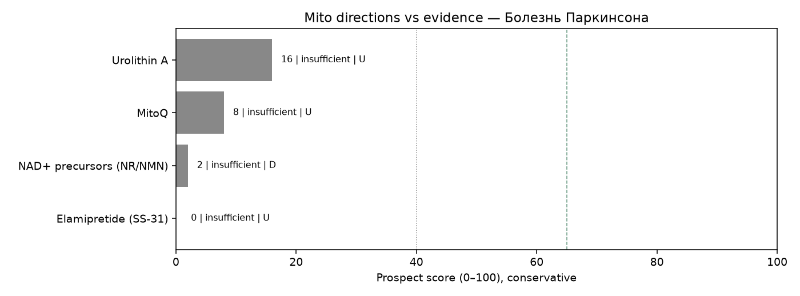

# Мини-обзор: митохондриальная терапия — Болезнь Паркинсона

_Сгенерировано Harness · 2026-09-30 12:06 UTC_

> **Не медицинская рекомендация.** Это исследовательский экспресс-обзор. Не начинайте, не отменяйте и не меняйте лечение на основании этого текста — решения принимает только лечащий врач.

## Запрос

Сравнение митохондриально-таргетной терапии и стандарта лечения при LHON за последние 5 лет: антиоксиданты, генная терапия мтДНК, перспективы и аутсайдеры

## Стандарт лечения (справочно из каталога, не назначение)

Леводопа/карбидопа, агонисты дофамина, ингибиторы МАО-B/COMT, глубокая стимуляция мозга при показаниях

## Источники (официальные)

Всего извлечено записей: **13** (только PubMed PMID и ClinicalTrials.gov NCT этого прогона).

- [42468665](https://pubmed.ncbi.nlm.nih.gov/42468665/), [DOI](https://doi.org/10.1016/j.neuint.2026.106224) — Is Urolithin A(UA) a pharmacologically credible neuro-nutraceutical? A critical review of mechanisms, brain exposure, and evidence gaps in Alzheimer's and Parkinson's disease. (type=`review`, evidence=`U`, effect=`null`, year=2026, journal=unknown)
- [41076415](https://pubmed.ncbi.nlm.nih.gov/41076415/), [DOI](https://doi.org/10.1016/j.expneurol.2025.115484) — Corrigendum to "Urolithin A improves Parkinson's disease-associated cognitive impairment through modulation of neuroinflammation and neuroplasticity" \[Experiment neurology, 2025 Nov:393:115395, Manuscript ID during submission is EXNR-25-789, The proof reference is YEXNR\_115395\]. (type=`unknown`, evidence=`U`, effect=`null`, year=2025, journal=trusted)
- [42370283](https://pubmed.ncbi.nlm.nih.gov/42370283/), [DOI](https://doi.org/10.21203/rs.3.rs-9970859/v1) — Nicotinamide Riboside Enhances Mitochondrial Bioenergetics and Dopaminergic Signaling Independent of Neuron Survival in a Double-Hit Parkinson's Model. (type=`preclinical`, evidence=`D`, effect=`null`, year=2026, journal=unknown)
- [42163657](https://pubmed.ncbi.nlm.nih.gov/42163657/), [DOI](https://doi.org/10.1161/CIRCULATIONAHA.121.056589) — Mitochondrial Function in Neurons and Glia in Health and Its Alteration in Parkinson's Disease: A Review. (type=`review`, evidence=`U`, effect=`null`, year=2026, journal=unknown)
- [41968748](https://pubmed.ncbi.nlm.nih.gov/41968748/), [DOI](https://doi.org/10.2174/0109298665436241260327111926) — Peptidomics: A New Dimension in Microbiome Research. (type=`review`, evidence=`U`, effect=`null`, year=2026, journal=unknown)
- [40878914](https://pubmed.ncbi.nlm.nih.gov/40878914/), [DOI](https://doi.org/10.1002/ana.78025) — Beta Power Response After Levodopa Intake in Parkinson's Disease Patients With Chronic Sensing-Enabled Deep Brain Stimulation. (type=`unknown`, evidence=`U`, effect=`null`, year=2025, journal=trusted)
- [42571859](https://pubmed.ncbi.nlm.nih.gov/42571859/), [DOI](https://doi.org/10.1016/j.nbd.2026.107571) — Gait-cycle-locked cortico-subthalamic signatures underlying freezing of gait and their modulation in Parkinson's disease. (type=`other`, evidence=`U`, effect=`null`, year=2026, journal=unknown)
- [42550252](https://pubmed.ncbi.nlm.nih.gov/42550252/), [DOI](https://doi.org/10.1016/j.intimp.2021.107498) — Comparative pharmacovigilance of Levodopa and Pramipexole: a disproportionality analysis of the FAERS database. (type=`cohort`, evidence=`C`, effect=`null`, year=2026, journal=unknown)
- [41535027](https://pubmed.ncbi.nlm.nih.gov/41535027/), [DOI](https://doi.org/10.2169/internalmedicine.6030-25) — Parkinsonism in Idiopathic Normal Pressure Hydrocephalus or Hydrocephalic Presentation in Parkinson's Disease: A Report of Three Cases. (type=`case_report`, evidence=`D`, effect=`null`, year=2026, journal=unknown)
- [37150070](https://pubmed.ncbi.nlm.nih.gov/37150070/), [DOI](https://doi.org/10.1016/j.parkreldis.2023.105410) — Fecal microbiota transplantation for Parkinson's disease using levodopa - carbidopa intestinal gel percutaneous endoscopic gastro-jejeunal tube. (type=`case_report`, evidence=`D`, effect=`null`, year=2023, journal=unknown)
- [33932705](https://pubmed.ncbi.nlm.nih.gov/33932705/), [DOI](https://doi.org/10.1016/j.parkreldis.2021.04.009) — Gastrointestinal surgery improved the absorption of levodopa in Parkinson's disease. (type=`case_report`, evidence=`D`, effect=`null`, year=2021, journal=unknown)
- [NCT07229261](https://clinicaltrials.gov/study/NCT07229261) — MitoQ (Mitoquinol Mesylate) to Ameliorate Vascular Function in Preeclampsia: a Novel Approach (type=`other`, evidence=`U`, effect=`null`, year=2026, nct_status=RECRUITING/active)
- [NCT06556706](https://clinicaltrials.gov/study/NCT06556706) — Impact of Urolithin A (Mitopure) on Mitochondrial Quality in Muscle of Frail Older Adults (type=`other`, evidence=`U`, effect=`null`, year=2024, nct_status=COMPLETED/completed)

## Сигналы качества источников

- Журналы: trusted=2, suspect=0, unknown=9
- Упоминания COI в abstract/notes: 0
- NCT active=1, terminal/withdrawn/suspended=0
- Impact Factor через внешний платный API не запрашивается: используется curated whitelist/suspect list (см. `tools/quality.py` + skill `quality_signals`).

## Рейтинг направлений (консервативный)

1. **Urolithin A** — score=16, label=`insufficient`, best=`U`, n=3, comparative_vs_SoC=not_supported. n=3; best=U; label=insufficient; human\_benefit=False; preclinical\_only=False; registry\_only=False; superior\_to\_soc\_supported=False; coi=0; journal\_suspect=0; nct\_terminal=0. IDs: 42468665, 41076415, NCT06556706
2. **MitoQ** — score=8, label=`insufficient`, best=`U`, n=1, comparative_vs_SoC=not_supported. n=1; best=U; label=insufficient; human\_benefit=False; preclinical\_only=False; registry\_only=True; superior\_to\_soc\_supported=False; coi=0; journal\_suspect=0; nct\_terminal=0. IDs: NCT07229261
3. **NAD+ precursors (NR/NMN)** — score=2, label=`insufficient`, best=`D`, n=1, comparative_vs_SoC=not_supported. n=1; best=D; label=insufficient; human\_benefit=False; preclinical\_only=True; registry\_only=False; superior\_to\_soc\_supported=False; coi=0; journal\_suspect=0; nct\_terminal=0. IDs: 42370283
4. **Elamipretide (SS-31)** — score=0, label=`insufficient`, best=`U`, n=0, comparative_vs_SoC=not_supported. n=0; insufficient\_data — нет PMID/NCT по направлению в этом прогоне. IDs: —

## Относительно более поддержанные направления

- Недостаточно данных, чтобы выделить перспективные направления в этом окне поиска.

## Аутсайдеры / недостаточно данных

- **MitoQ** (score=8, `insufficient`): n=1; best=U; label=insufficient; human\_benefit=False; preclinical\_only=False; registry\_only=True; superior\_to\_soc\_supported=False; coi=0; journal\_suspect=0; nct\_terminal=0.
- **NAD+ precursors (NR/NMN)** (score=2, `insufficient`): n=1; best=D; label=insufficient; human\_benefit=False; preclinical\_only=True; registry\_only=False; superior\_to\_soc\_supported=False; coi=0; journal\_suspect=0; nct\_terminal=0.
- **Elamipretide (SS-31)** (score=0, `insufficient`): n=0; insufficient\_data — нет PMID/NCT по направлению в этом прогоне.

## Визуализация

## Сравнение с SoC

Превосходство митотерапии над стандартом **не заявляется**, если нет человеческих сравнительных данных (РКИ/метаанализ с компаратором) в извлечённых записях. Доклиника и записи ClinicalTrials.gov без результатов не равны клинической эффективности.

## Верификация (Reviewer)

- ok=True
- Критических замечаний нет.
- verified IDs in pipeline: 10.1002/ana.78025, 10.1016/j.expneurol.2025.115484, 10.1016/j.intimp.2021.107498, 10.1016/j.nbd.2026.107571, 10.1016/j.neuint.2026.106224, 10.1016/j.parkreldis.2021.04.009, 10.1016/j.parkreldis.2023.105410, 10.1161/CIRCULATIONAHA.121.056589, 10.21203/rs.3.rs-9970859/v1, 10.2169/internalmedicine.6030-25, 10.2174/0109298665436241260327111926, 33932705, 37150070, 40878914, 41076415, 41535027, 41968748, 42163657, 42370283, 42468665, 42550252, 42571859, NCT06556706, NCT07229261

## Skills

`evidence_levels`, `prospect_criteria`, `safety_guardrails`, `mito_extraction_rules`, `citation_checklist`, `quality_signals`

## Ограничения

- Экспресс-обзор, не систематический обзор/метаанализ
- Окно поиска ~5 лет
- Возможны пропуски из‑за формулировок запросов
- Не является клинической рекомендацией; не меняйте терапию самостоятельно
- Эффект без явной опоры в abstract очищается (анти-галлюцинация)
- ClinicalTrials.gov без результатов не считается доказанной эффективностью
- Ярлык promising не выдаётся при отсутствии человеческих данных A/B/C
- Suspect-журналы и terminal NCT понижают score и не тянут promising
- Impact Factor числом не подтягивается (нет платного API) — whitelist/suspect эвристика
- COI извлекается только если явно упомянут в abstract/notes
