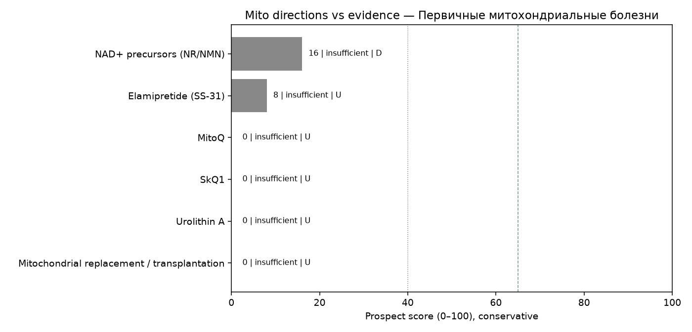

# Мини-обзор: митохондриальная терапия при Первичные митохондриальные болезни

_Сгенерировано Harness · 2026-09-30 09:25 UTC_

> **Не медицинская рекомендация.** Это исследовательский экспресс-обзор. Не начинайте, не отменяйте и не меняйте лечение на основании этого текста — решения принимает только лечащий врач.

## Запрос
MitoQ OR elamipretide OR NAD in Primary mitochondrial diseases

## Стандарт лечения (справочно из каталога, не назначение)
Симптоматическая терапия, кофакторные коктейли (CoQ10, рибофлавин, L-карнитин), избегание митотоксинов

## Источники (официальные)
Всего извлечено записей: **11** (только PubMed PMID и ClinicalTrials.gov NCT этого прогона).

- [41260682](https://pubmed.ncbi.nlm.nih.gov/41260682/), DOI:10.5582/ddt.2025.01111 — Elamipretide: The first cardiolipin-directed mitochondrial therapeutic for Barth syndrome approved under accelerated approval. (type=other, evidence=U, effect=null, year=2026, journal=unknown)
- [38194959](https://pubmed.ncbi.nlm.nih.gov/38194959/), DOI:10.1111/jnc.16041 — Nicotinamide mononucleotide alleviates seizures via modulating SIRT1-PGC-1α mediated mitochondrial fusion and fission. (type=preclinical, evidence=D, effect=null, year=2024, journal=unknown)
- [35940554](https://pubmed.ncbi.nlm.nih.gov/35940554/), DOI:10.1016/j.molmet.2022.101560 — Nicotinamide riboside alleviates exercise intolerance in ANT1-deficient mice. (type=preclinical, evidence=D, effect=null, year=2022, journal=unknown)
- [41008646](https://pubmed.ncbi.nlm.nih.gov/41008646/), DOI:10.62767/jecacm504.6557 — Mitochondrial Reactive Oxygen Species: A Unifying Mechanism in Long COVID and Spike Protein-Associated Injury: A Narrative Review. (type=review, evidence=U, effect=null, year=2025, journal=unknown)
- [42361626](https://pubmed.ncbi.nlm.nih.gov/42361626/), DOI:10.1016/j.biopha.2026.119699 — Clinical development in primary mitochondrial diseases at a translational inflection point: Lessons, mechanisms, and emerging therapeutic strategies. (type=review, evidence=U, effect=null, year=2026, journal=unknown)
- [42065208](https://pubmed.ncbi.nlm.nih.gov/42065208/), DOI:10.1097/MD.0000000000047264 — Phenotypic heterogeneity within twins with MELAS with epilepsy: Case report. (type=case_report, evidence=D, effect=null, year=2026, journal=unknown)
- [37541860](https://pubmed.ncbi.nlm.nih.gov/37541860/), DOI:10.1016/j.nmd.2023.06.002 — 258th ENMC international workshop Leigh syndrome spectrum: genetic causes, natural history and preparing for clinical trials 25-27 March 2022, Hoofddorp, Amsterdam, The Netherlands. (type=other, evidence=U, effect=null, year=2023, journal=unknown)
- [37194524](https://pubmed.ncbi.nlm.nih.gov/37194524/), DOI:10.11477/mf.1416202371 — [Therapeutics for Mitochondrial Encephalomyopathy]. (type=other, evidence=U, effect=null, year=2023, journal=trusted)
- [36509339](https://pubmed.ncbi.nlm.nih.gov/36509339/), DOI:10.1016/j.mito.2022.12.001 — UQCRC2-related mitochondrial complex III deficiency, about 7 patients. (type=unknown, evidence=U, effect=null, year=2023, journal=unknown)
- [NCT05191979](https://clinicaltrials.gov/study/NCT05191979) — Importance of Blood Volume and Its Interaction With Cardiovascular Adaptations (type=other, evidence=U, effect=null, year=2022, nct_status=UNKNOWN/other)
- [NCT05750979](https://clinicaltrials.gov/study/NCT05750979) — Quantifying Disease Progression in Leukoencephalopathy With Brainstem and Spinal Cord Involvement and Lactate Elevation (LBSL) (type=other, evidence=U, effect=null, year=2021, nct_status=UNKNOWN/other)

## Сигналы качества источников
- Журналы: trusted=1, suspect=0, unknown=8
- Упоминания COI в abstract/notes: 0
- NCT active=0, terminal/withdrawn/suspended=0
- Impact Factor через внешний платный API не запрашивается: используется curated whitelist/suspect list (см. `tools/quality.py` + skill `quality_signals`).

## Рейтинг направлений (консервативный)
1. **NAD+ precursors (NR/NMN)** — score=16, label=`insufficient`, best=D, n=2, comparative_vs_SoC=not_supported. n=2; best=D; label=insufficient; human_benefit=False; preclinical_only=True; registry_only=False; superior_to_soc_supported=False; coi=0; journal_suspect=0; nct_terminal=0. IDs: 38194959, 35940554
2. **Elamipretide (SS-31)** — score=8, label=`insufficient`, best=U, n=1, comparative_vs_SoC=not_supported. n=1; best=U; label=insufficient; human_benefit=False; preclinical_only=False; registry_only=False; superior_to_soc_supported=False; coi=0; journal_suspect=0; nct_terminal=0. IDs: 41260682
3. **MitoQ** — score=0, label=`insufficient`, best=U, n=0, comparative_vs_SoC=not_supported. n=0; insufficient_data — нет PMID/NCT по направлению в этом прогоне. IDs: —
4. **SkQ1** — score=0, label=`insufficient`, best=U, n=0, comparative_vs_SoC=not_supported. n=0; insufficient_data — нет PMID/NCT по направлению в этом прогоне. IDs: —
5. **Urolithin A** — score=0, label=`insufficient`, best=U, n=0, comparative_vs_SoC=not_supported. n=0; insufficient_data — нет PMID/NCT по направлению в этом прогоне. IDs: —
6. **Mitochondrial replacement / transplantation** — score=0, label=`insufficient`, best=U, n=0, comparative_vs_SoC=not_supported. n=0; insufficient_data — нет PMID/NCT по направлению в этом прогоне. IDs: —

## Относительно более поддержанные направления
- Недостаточно данных, чтобы выделить перспективные направления в этом окне поиска.

## Аутсайдеры / недостаточно данных
- **SkQ1** (score=0, `insufficient`): n=0; insufficient_data — нет PMID/NCT по направлению в этом прогоне.
- **Urolithin A** (score=0, `insufficient`): n=0; insufficient_data — нет PMID/NCT по направлению в этом прогоне.
- **Mitochondrial replacement / transplantation** (score=0, `insufficient`): n=0; insufficient_data — нет PMID/NCT по направлению в этом прогоне.

## Визуализация

## Сравнение с SoC
Превосходство митотерапии над стандартом **не заявляется**, если нет человеческих сравнительных данных (РКИ/метаанализ с компаратором) в извлечённых записях. Доклиника и записи ClinicalTrials.gov без результатов не равны клинической эффективности.

## Верификация (Reviewer)
- ok=True
- Критических замечаний нет.
- verified IDs in pipeline: 10.1016/j.biopha.2026.119699, 10.1016/j.mito.2022.12.001, 10.1016/j.molmet.2022.101560, 10.1016/j.nmd.2023.06.002, 10.1097/MD.0000000000047264, 10.1111/jnc.16041, 10.11477/mf.1416202371, 10.5582/ddt.2025.01111, 10.62767/jecacm504.6557, 35940554, 36509339, 37194524, 37541860, 38194959, 41008646, 41260682, 42065208, 42361626, NCT05191979, NCT05750979

## Skills
evidence_levels, prospect_criteria, safety_guardrails, mito_extraction_rules, citation_checklist, quality_signals

## Ограничения
- Экспресс-обзор, не систематический обзор/метаанализ
- Окно поиска ~5 лет
- Возможны пропуски из‑за формулировок запросов
- Не является клинической рекомендацией; не меняйте терапию самостоятельно
- Эффект без явной опоры в abstract очищается (анти-галлюцинация)
- ClinicalTrials.gov без результатов не считается доказанной эффективностью
- Ярлык promising не выдаётся при отсутствии человеческих данных A/B/C
- Suspect-журналы и terminal NCT понижают score и не тянут promising
- Impact Factor числом не подтягивается (нет платного API) — whitelist/suspect эвристика
- COI извлекается только если явно упомянут в abstract/notes
