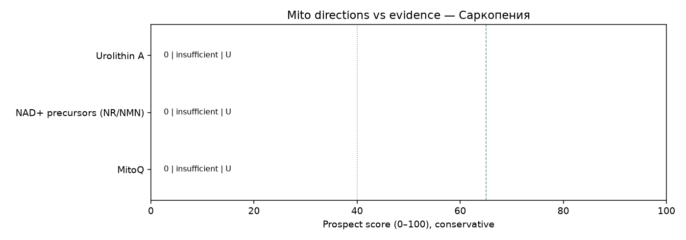

# Мини-обзор: митохондриальная терапия при Саркопения

_Сгенерировано Harness · 2026-09-30 09:27 UTC_

> **Не медицинская рекомендация.** Это исследовательский экспресс-обзор. Не начинайте, не отменяйте и не меняйте лечение на основании этого текста — решения принимает только лечащий врач.

## Запрос
MitoQ OR elamipretide OR NAD in Sarcopenia

## Стандарт лечения (справочно из каталога, не назначение)
Силовые тренировки, достаточный белок, лечение вторичных причин

## Источники (официальные)
Всего извлечено записей: **12** (только PubMed PMID и ClinicalTrials.gov NCT этого прогона).

- [42508389](https://pubmed.ncbi.nlm.nih.gov/42508389/), DOI:10.14336/AD.2026.0758 — A C. elegans-to-Mouse Discovery Framework for Prioritizing Sarcopenia Interventions. (type=review, evidence=U, effect=null, year=2026, journal=unknown)
- [41512967](https://pubmed.ncbi.nlm.nih.gov/41512967/), DOI:10.1016/j.jconrel.2025.114595 — Energy-replenishing, mitochondria-targeted hydrogel microspheres mitigate sarcopenia via cellular senescence amelioration. (type=unknown, evidence=U, effect=null, year=2026, journal=unknown)
- [41274424](https://pubmed.ncbi.nlm.nih.gov/41274424/), DOI:10.1016/j.exger.2025.112970 — Disruption of Rab9-dependent mitophagy contributes to menopause-induced sarcopenia. (type=preclinical, evidence=D, effect=null, year=2026, journal=unknown)
- [40846977](https://pubmed.ncbi.nlm.nih.gov/40846977/), DOI:10.1186/s13395-025-00390-6 — NAD+ dyshomeostasis in RYR1-related myopathies. (type=unknown, evidence=U, effect=null, year=2025, journal=unknown)
- [39719170](https://pubmed.ncbi.nlm.nih.gov/39719170/), DOI:10.1016/j.metabol.2024.156113 — Effect of glucagon-like peptide-1 receptor agonists and co-agonists on body composition: Systematic review and network meta-analysis. (type=meta_analysis, evidence=A, effect=null, year=2025, journal=unknown)
- [41205420](https://pubmed.ncbi.nlm.nih.gov/41205420/), DOI:10.3389/fphys.2025.1681184/full — Comparative Effectiveness of Exercise and Protein-Based Interventions on Muscle Strength, Mass, and Function in Sarcopenia: A Systematic Review and Network Meta-Analysis. (type=meta_analysis, evidence=A, effect=null, year=2025, journal=unknown)
- [35334912](https://pubmed.ncbi.nlm.nih.gov/35334912/), DOI:10.1002/jrsm.1123 — Creatine Supplementation for Muscle Growth: A Scoping Review of Randomized Clinical Trials from 2012 to 2021. (type=review, evidence=U, effect=null, year=2022, journal=unknown)
- [41342363](https://pubmed.ncbi.nlm.nih.gov/41342363/), DOI:10.1530/JOE-25-0275 — Effects of combined aerobic and resistance exercise on sarcopenia in elderly patients with type 2 diabetes mellitus. (type=rct, evidence=B, effect=null, year=2025, journal=unknown)
- [42020128](https://pubmed.ncbi.nlm.nih.gov/42020128/), DOI:10.1136/bmj.c332 — LEAN mass Preservation with Resistance Exercise and Protein during semaglutide and tirzepatide therapy (LEAN-PREP study): a protocol for a randomised controlled trial. (type=rct, evidence=B, effect=null, year=2026, journal=trusted)
- [42141930](https://pubmed.ncbi.nlm.nih.gov/42141930/), DOI:10.1080/15502783.2025.2488937 — Creatine monohydrate for lean mass, strength, and bone density in postmenopausal women: a systematic review and meta-analysis. (type=meta_analysis, evidence=A, effect=null, year=2026, journal=unknown)
- [NCT05191979](https://clinicaltrials.gov/study/NCT05191979) — Importance of Blood Volume and Its Interaction With Cardiovascular Adaptations (type=other, evidence=U, effect=null, year=2022, nct_status=UNKNOWN/other)
- [NCT05750979](https://clinicaltrials.gov/study/NCT05750979) — Quantifying Disease Progression in Leukoencephalopathy With Brainstem and Spinal Cord Involvement and Lactate Elevation (LBSL) (type=other, evidence=U, effect=null, year=2021, nct_status=UNKNOWN/other)

## Сигналы качества источников
- Журналы: trusted=1, suspect=0, unknown=9
- Упоминания COI в abstract/notes: 0
- NCT active=0, terminal/withdrawn/suspended=0
- Impact Factor через внешний платный API не запрашивается: используется curated whitelist/suspect list (см. `tools/quality.py` + skill `quality_signals`).

## Рейтинг направлений (консервативный)
1. **Urolithin A** — score=0, label=`insufficient`, best=U, n=0, comparative_vs_SoC=not_supported. n=0; insufficient_data — нет PMID/NCT по направлению в этом прогоне. IDs: —
2. **NAD+ precursors (NR/NMN)** — score=0, label=`insufficient`, best=U, n=0, comparative_vs_SoC=not_supported. n=0; insufficient_data — нет PMID/NCT по направлению в этом прогоне. IDs: —
3. **MitoQ** — score=0, label=`insufficient`, best=U, n=0, comparative_vs_SoC=not_supported. n=0; insufficient_data — нет PMID/NCT по направлению в этом прогоне. IDs: —

## Относительно более поддержанные направления
- Недостаточно данных, чтобы выделить перспективные направления в этом окне поиска.

## Аутсайдеры / недостаточно данных
- **Urolithin A** (score=0, `insufficient`): n=0; insufficient_data — нет PMID/NCT по направлению в этом прогоне.
- **NAD+ precursors (NR/NMN)** (score=0, `insufficient`): n=0; insufficient_data — нет PMID/NCT по направлению в этом прогоне.
- **MitoQ** (score=0, `insufficient`): n=0; insufficient_data — нет PMID/NCT по направлению в этом прогоне.

## Визуализация

## Сравнение с SoC
Превосходство митотерапии над стандартом **не заявляется**, если нет человеческих сравнительных данных (РКИ/метаанализ с компаратором) в извлечённых записях. Доклиника и записи ClinicalTrials.gov без результатов не равны клинической эффективности.

## Верификация (Reviewer)
- ok=True
- Критических замечаний нет.
- verified IDs in pipeline: 10.1002/jrsm.1123, 10.1016/j.exger.2025.112970, 10.1016/j.jconrel.2025.114595, 10.1016/j.metabol.2024.156113, 10.1080/15502783.2025.2488937, 10.1136/bmj.c332, 10.1186/s13395-025-00390-6, 10.14336/AD.2026.0758, 10.1530/JOE-25-0275, 10.3389/fphys.2025.1681184/full, 35334912, 39719170, 40846977, 41205420, 41274424, 41342363, 41512967, 42020128, 42141930, 42508389, NCT05191979, NCT05750979

## Skills
evidence_levels, prospect_criteria, safety_guardrails, mito_extraction_rules, citation_checklist, quality_signals

## Ограничения
- Экспресс-обзор, не систематический обзор/метаанализ
- Окно поиска ~5 лет
- Возможны пропуски из‑за формулировок запросов
- Не является клинической рекомендацией; не меняйте терапию самостоятельно
- Эффект без явной опоры в abstract очищается (анти-галлюцинация)
- ClinicalTrials.gov без результатов не считается доказанной эффективностью
- Ярлык promising не выдаётся при отсутствии человеческих данных A/B/C
- Suspect-журналы и terminal NCT понижают score и не тянут promising
- Impact Factor числом не подтягивается (нет платного API) — whitelist/suspect эвристика
- COI извлекается только если явно упомянут в abstract/notes
